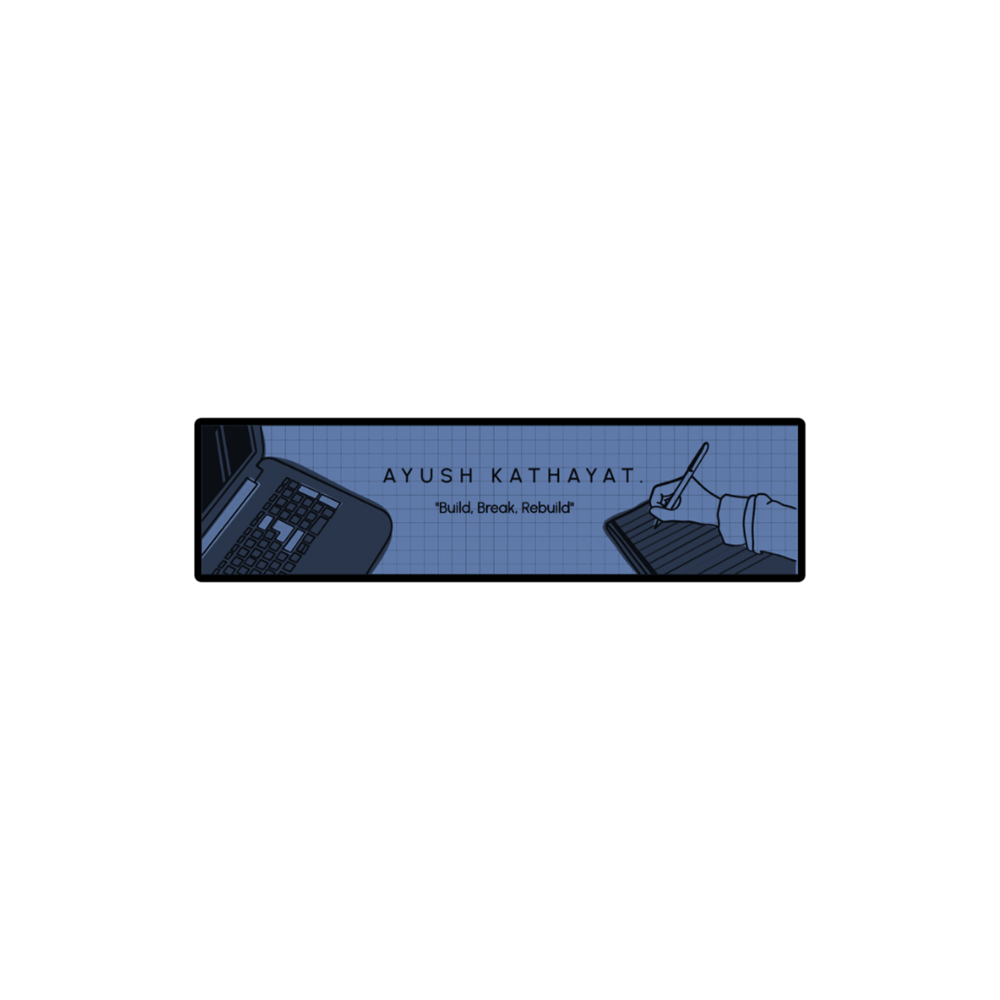

    
    
    
    

>**I am a Frontend Developer Intern at [Goalteller](https://goalteller.com/), with a strong foundation in full stack development, including experience with Next.js and TypeScript. As a passionate blockchain enthusiast, I have worked on several blockchain projects and continually seek to expand my knowledge and skills. I am a highly motivated individual with strong technical and problem-solving abilities, excellent time management, leadership, and teamwork skills. I thrive in dynamic environments where I can make a meaningful impact and enjoy socializing and exploring new experiences in life.**

## 🛠️ Tech Stack:
&nbsp;
&nbsp;
&nbsp;
&nbsp;\
&nbsp;
&nbsp;
&nbsp;
&nbsp;
&nbsp;\
&nbsp;
&nbsp;\
&nbsp;
&nbsp;
&nbsp;
&nbsp;\
&nbsp;
&nbsp;
&nbsp;

## 📈 GitHub Activity Graph:

<table>
    <tr>
        <td align="center"></td>
        <td rowspan="2" align="center"></td>
    </tr>
    <tr>
        <td align="center"></td>
    </tr>
    <tr>
        <td colspan="2" align="center"></td>
    </tr>
</table>
